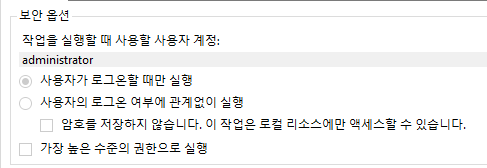
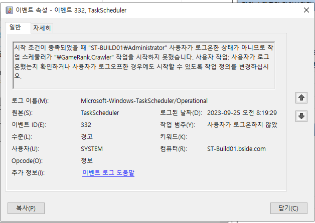

## 브라우저 화면이 보이도록 forground 실행으로 설정

참고 : https://forum.dotnetdev.kr/t/windows-net-console-app/5303

브라우저 가로 너비에 따라 내용 구성이 달라지는 반응형 페이지를 크롤링 하려면 셀레니움이 실행하는 브라우저가 포그라운드로 동작하게 한 후 윈도우 최대화 처리를 해주어야 한다.

`사용자가 로그온할 때만 실행` 옵션으로 지정해야 포그라운드에서 실행된다.

### 보안 옵션 변경 후 실행이 불가한 경우

장비내에 administrator 계정이 여럿인 경우가 있다. 이 때에는 어느 도메인의 관리자인지 제대로 찾아서 설정해야 한다.