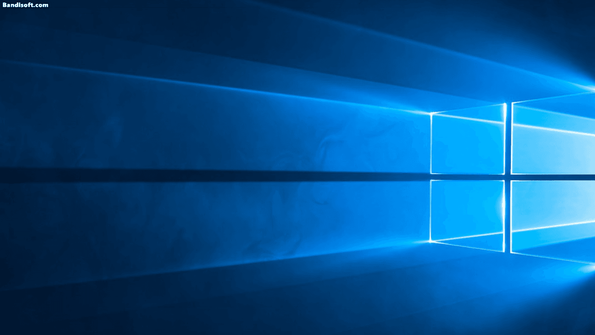

## 게임 매출 순위 알림

간간히 찾아보는 게임 매출 순위 정보를 슬랙으로 받아보게 해주는 toy project 입니다. 데이터는 [https://app.sensortower.com/](https://app.sensortower.com/) 에서 가져옵니다. 

### 데이터 수집



[selenium](https://www.selenium.dev/)을 이용해 웹페이지를 크롤링합니다. 스케줄러를 이용해 매일 한 번씩 구동시켜주면 일간 랭킹 정보를 수집에 로컬 디스크에 저장합니다.

### 데이터 보관

수집한 데이터는 설정파일에서 지정한 경로 아래에 연/월 별로 구분한 폴더에 저장합니다. (차후에는 여러 날짜의 데이터를 이용한 분석도 시도해볼 예정입니다.) 저장 포맷은 json 입니다. 

```json
{
  "Date": "2023-09-21T09:01:58.590909+09:00",
  "Ranks": [
    {
      "Ranking": 1,
      "ImageUrl": "https://play-lh.googleusercontent.com/TSJx_-ml28RDZAN1popUnr2G0AKJS8xeoCh975QKOeF21FQl5J5lNCuJmaOi_7ufCYI=s48",
      "Title": "리니지M",
      "Publisher": "NCSOFT"
    },
    {
      "Ranking": 2,
      "ImageUrl": "https://play-lh.googleusercontent.com/HCtN3GTLYipk8Sn7zFhV501RkpxBnTpLacU8dC5EU-N8RoI7kGr7GB7kFELull9riO0=s48",
      "Title": "리니지2M",
      "Publisher": "NCSOFT"
    },
    {
      "Ranking": 3,
      "ImageUrl": "https://play-lh.googleusercontent.com/hkPFKk-cJMLeZyklDSViUHCgkyiMKQ_BDZBnhIPBUuyIuLjv5_F0mkNUIFMuEtFlDPCP=s48",
      "Title": "세븐나이츠 키우기 - 1,777뽑기 증정",
      "Publisher": "Netmarble"
    },
    // .... 중략. 
  ]
}
```

### 알림

```
TODO: 슬랙 화면 스샷 붙이기
```

`note: 본 저장소에는 수집 및 저장 처리만을 담고 있습니다. 슬랙봇 코드는 재직 중인 회사의 코드라 공개하지 않았습니다.`

수집은 매일 새벽에 실행되어 데이터를 저장하고, 슬랙 사용자의 약속된 명령어를 이용해 댓글로 데이터를 보여줍니다.
