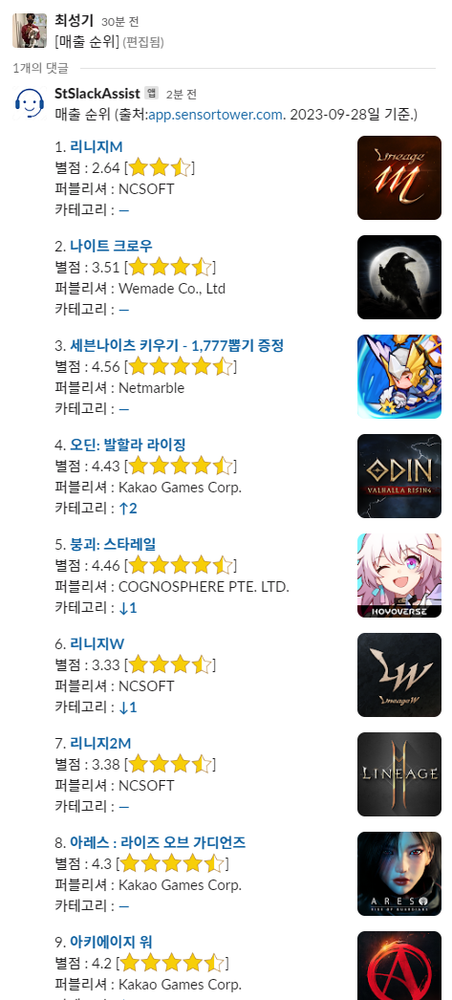

 

## 게임 매출 순위 알림

간간히 찾아보는 게임 매출 순위 정보를 슬랙으로 받아보게 해주는 toy project 입니다. 데이터는 [https://app.sensortower.com/](https://app.sensortower.com/) 에서 가져옵니다. 
데이터 크롤링은 [selenium](https://www.selenium.dev/)을 사용합니다.



## About this repository..

> note : 본 저장소에는 데이터 수집 및 저장 처리만을 포함합니다. (슬랙봇 코드는 재직중인 회사의 코드입니다.)
> GameRank.Core 모듈은 저장된 json 데이터를 로딩하는 처리까지 포함하고 있으므로 이후 랭킹 정보의 view layer는 슬랙, 이메일, 웹페이지등 다양하게 연동 가능합니다.

해당 repositiory는 crawler 설정법을 상세히 기술하지 않습니다. 로직이 많지 않으니 구현에 관심이 있다면 코드를 직접 참고해 주세요. 로직이나 설계 개선 등에 관한 이슈는 환영입니다.

다른 실행 환경에서의 재사용을 위해 crawler를 추가 수정할 의도가 없으며, 개인 프로젝트의 보관 및 코드 공유 용도로만 공개합니다. 

### 데이터 수집


크롤러는 `GameRank.Crawler`프로젝트를 빌드해서 얻을 수 있습니다. 스케줄러를 이용해 매일 한 번씩 구동시켜주면 일간 랭킹 정보를 수집에 로컬 디스크에 저장합니다. [스케줄러 설정에 대한 주의사항](./Document/SchedulerSetting.md)에 설정하면서 겪었던 삽질에 관하여 일부 정리했습니다.

### 데이터 보관

수집한 데이터는 설정파일에서 지정한 경로 아래에 연/월 별로 구분한 폴더에 저장합니다. 저장 포맷은 json 입니다. 

```json
{
  "Date": "2023-09-21T09:01:58.590909+09:00",
  "Ranks": [
    {
      "Ranking": 1,
      "ImageUrl": "https://play-lh.googleusercontent.com/TSJx_-ml28RDZAN1popUnr2G0AKJS8xeoCh975QKOeF21FQl5J5lNCuJmaOi_7ufCYI=s48",
      "Title": "리니지M",
      "Publisher": "NCSOFT"
    },
    {
      "Ranking": 2,
      "ImageUrl": "https://play-lh.googleusercontent.com/HCtN3GTLYipk8Sn7zFhV501RkpxBnTpLacU8dC5EU-N8RoI7kGr7GB7kFELull9riO0=s48",
      "Title": "리니지2M",
      "Publisher": "NCSOFT"
    },
    // .... 중략. 
  ]
}
```

위의 json 예시는 프로젝트 초반 기준이어서 정보가 몇 없지만, 현재 보관하는 정보에는 별점 등이 더 포함되었습니다. 이는 [SingleRankData.cs](./GameRank.Core/SingleRankData.cs) 타입의 프로퍼티상에 표현됩니다.

```csharp
public sealed record SingleRankData : IComparable<SingleRankData>
{
    public int Ranking { get; init; } // 1-base로 시작하는 랭킹
    public required string ImageUrl { get; init; } // 게임 아이콘 이미지
    public required string Title { get; init; } // 게임 타이틀(이름)
    public required string Publisher { get; init; } // 퍼블리셔 회사명
    public required string SummaryPageUrl { get; init; } // sensortower가 제공하는 게임 상세페이지 url
    public float StarGrade { get; init; } // 구글 플레이스토어 평점
    public required string CategoryPageUrl { get; init; } // 게임 카테고리 순위 변동 정보 페이지 url
    public required string CategoryText { get; init; } // 소속 카테고리 내 순위 등락 정보 (ex: ↑2, ↓1, -)
}
```

### 프로젝트 하면서 얻은 것들

* 일단 `매출 순위 자동 알림 봇`을 얻음. 매주 자동알림 오게 해두고 볼 예정.
* `vscode` 개발환경 체득. 이제 mac에서 간단한 c# 프로젝트 구현 가능.
* `vim` 편집 방식 활용도 향상.
* `nuget package` 배포 처음으로 해봄.
* `selenium` 라이브러리 처음 사용해봄.
* `closed shadow dom` 이란 존재에 대해 알게 됨. (뚫는 법 알고 싶다...)
